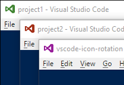

# vscode-icon-rotation
Start VS Code instances each with an own icon.



This extension provides the Installer for the actual Windows program.

Currently only the Windows platform is supported.

## Installation
- After installing this extension, press `F1` and select the `Icon Rotation: Open installer folder` command from the list.
- Install the actual program by running `vscode-icon-rotation.msi` from the opened folder.

The Installer creates a shortcut to the 'deamon' in the common startup folder and adds the program's installation path to the system path.

## Usage
* Make sure `vscode-icon-rotation.exe`, the 'deamon', is running.
* Copy an icon to `my-vscode-project\.vscode\vscode.ico`
* Run `codee my-vscode-project` and the newly created VS Code window should display your icon.

Note `codee` instead of `code`.

The `%USERPROFILE%\.vscode\extensions\krizzdewizz.vscode-icon-rotation-1.0.0\icons` folder contains some colorized VS Code icons to be used.

## How it works
`vscode-icon-rotation.exe` is a 'deamon' which is notified whenever a new VS Code window is created and replaces the icon of the newly created window with `%temp%\vsciconrot_next.ico`.

`codee.exe` is used to start VS Code, but before, it replaces `%temp%\vsciconrot_next.ico` with an eventually existing `my-vscode-project\.vscode\vscode.ico` file.

It takes a single parameter; the folder to open in VS Code:

```
codee my-vscode-project
```

If there exists a `%1\.vscode\vscode.ico` icon file, it is copied to `%temp%\vsciconrot_next.ico`, which is then picked up by the deamon.

You must not necessarily use `codee`. Just make sure that `%temp%\vsciconrot_next.ico` is updated before you start VS Code.

The common startup folder can be opened by running `shell:common startup`.

## Release Info

v1.0.0
- Initial release

## Build

- install AutoHotkey from their website.
- run `build-exe.cmd` to generate executables from the `ahk`s using `ahk2exe`.
- build the installer `wix/icon-rotation/icon-rotation.wixproj` with Visual Studio.
- run `vsce package`.
