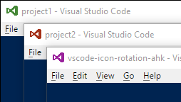

# vscode-icon-rotation-ahk
AutoHotkey scripts to start VS Code instances each with an own icon.



## Usage
* Download and extract the [distribution](https://github.com/krizzdewizz/vscode-icon-rotation-ahk/raw/master/dist/vscode-icon-rotation-ahk/vscode-icon-rotation-ahk-dist.zip) to a folder.
* Start `on-vscode-set-next-icon.exe` and leave it running in the background. You may want to put a link into the Windows `Startup` folder.
* Copy an icon to `my-vscode-project\.vscode\vscode.ico`
* Run `codee my-vscode-project` and the newly created VS Code window should display your icon.

The `icons` folder contains some colorized VS Code icons to be used.

## How it works

`on-vscode-set-next-icon.exe` is a 'deamon' which is notified whenever a new VS Code window is created and replaces the icon of the newly created window with `%temp%\vsciconrot_next.ico`.

`codee.exe` is used to start VS Code, but before, it replaces `%temp%\vsciconrot_next.ico` with an eventually existing `%1\.vscode\vscode.ico` file.

It takes a single parameter; the folder to open in VS Code:

```
codee my-vscode-project
```

If there exists a `%1\.vscode\vscode.ico` icon file, it is copied to `%temp%\vsciconrot_next.ico`, which is then picked up by the deamon.

You must not necessarily use `codee`. Just make sure that `%temp%\vsciconrot_next.ico` is updated before you start VS Code.

## Build

Install AutoHotkey from their website.

Run `build.cmd` to generate executables from the `ahk`s using `ahk2exe`.
