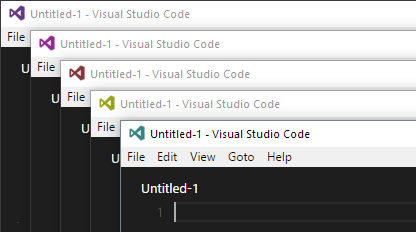

# vscode-icon-rotation
Patches an existing VS Code installation so that every new window gets its own colorful icon. Useful when there are lots of VS Code windows open.



## Apply the patch (Windows)

Change to administrator mode when VS Code is installed in `Program Files (x86)`.

```
npm install
npm run patch
```

## Apply the patch (non-Windows)

In `patch.ts`, let VS_CODE_ROOT point to your VS Code installation then proceed as described above and replace the `.ico` files with `.png` files.

To create a nice palette of icons, you may want to run

```
npm run gen-icons
```

and copy the resulting pngs from `out` to `<vscode-install-dir>/resources/app/resources/krizzdewizz-icon-rotation`.
